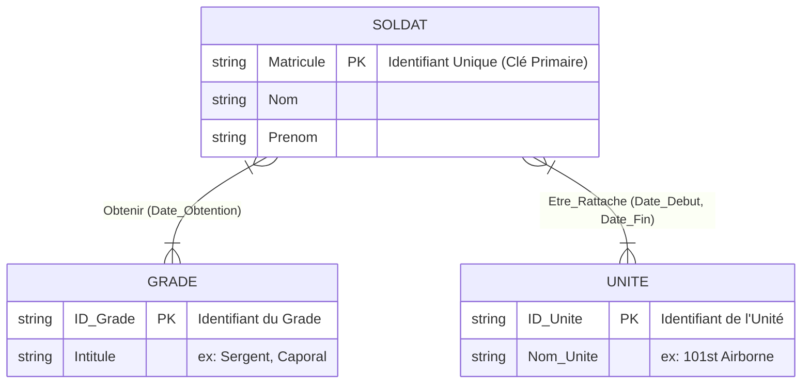

# Exercice 1 : Modélisation (Seconde Guerre mondiale)

## 1) Diagramme Entité-Association (Schéma Conceptuel)
On a un soldat caractérisé par son matricule, nom, et prénom. 
Ce soldat peut obtenir plusieurs grades à travers le temps (associé à une date) et être affecté à plusieurs unités (avec date de début et de fin d'affectation).

### Règles de Gestion (exprimées par le schéma) :
- Un *SOLDAT* a pu obtenir de 1 à plusieurs *n* `GRADEs` (selon les dates).
- Un *GRADE* a pu être obtenu par plusieurs *n* `SOLDATS`. *(Relation N-M : Many-to-Many)*. La date est une propriété de cette obtention.
- Un *SOLDAT* peut appartenir à plusieurs *n* `UNITÉS` (changements d'affectation consécutifs).
- Une *UNITE* contient plusieurs *n* `SOLDATS`. *(Relation N-M)*. Les dates de début et de fin sont propres à cette affectation.

---

## 2) Transformation en Schéma Relationnel (Modèle Logique)

Lors de la traduction en base de données SQL (relationnel), les associations de type N-M (Many-to-Many) se transforment toujours en **Tables Intermédiaires** (ou Tables de jointure), dont la clé primaire est composée des clés primaires des deux tables parentes, ainsi que des propriétés de l'association si elles font partie du caractère d'unicité.

**Tables créées :** (Les *clés primaires sont soulignées et en gras*, les # clés étrangères ont un croisillon avant).

1. **Table SOLDAT( )**
   - **`Matricule`** [Clé Primaire unique, Type VARCHAR/INT]
   - `Nom` [Varchar]
   - `Prenom` [Varchar]
  
2. **Table GRADE( )**
   - **`ID_Grade`** [Clé Primaire unique, INT]
   - `Intitule` [Varchar]

3. **Table UNITE( )**
   - **`ID_Unite`** [Clé Primaire unique, INT]
   - `Nom_Unite` [Varchar]

4. **Table de jointure OBTENTION_GRADE( )** (La relation entre Soldat et Grade)
   - **`#Matricule_Soldat`** [Clé Étrangère vers SOLDAT, fait partie de la PK composée]
   - **`#ID_Grade`** [Clé Étrangère vers GRADE, fait partie de la PK composée]
   - **`Date_Obtention`** [DATE, fait également partie de la PK si le soldat peut reprendre le même grade un autre jour, sinon c'est juste un attribut]
   - *(Note: PK Composée = `Matricule_Soldat` + `ID_Grade` + `Date_Obtention`)*

5. **Table de jointure RATTATCHEMENT_UNITE( )** (La relation entre Soldat et Unité)
   - **`#Matricule_Soldat`** [Clé Étrangère vers SOLDAT, PK Composée]
   - **`#ID_Unite`** [Clé Étrangère vers UNITE, PK Composée]
   - **`Date_Debut`** [DATE, faisant partie de la PK Composée pour gérer les allers-retours dans la même unité]
   - `Date_Fin` [DATE, simple colonne pour acter la fin, car par defaut elle est peut-être NULL et ne sert pas à l'identifier formellement]
