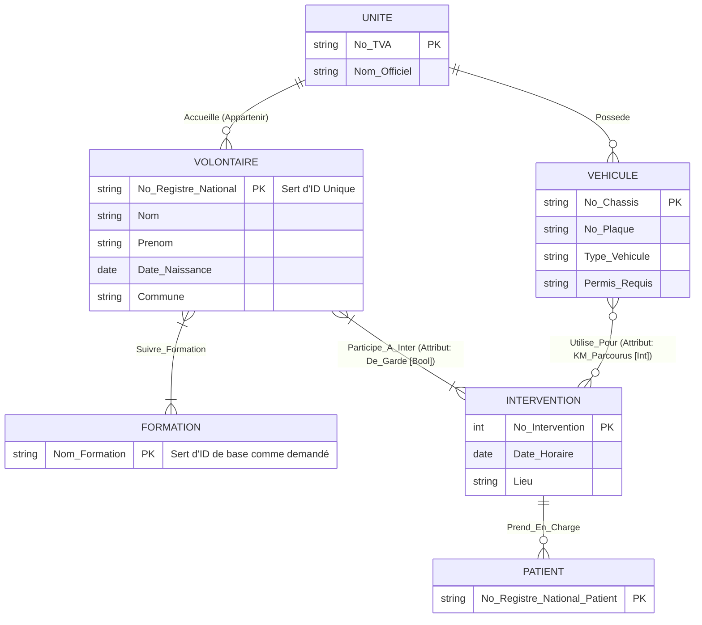

# Exercice 2 : La Croix-Rouge de Belgique (CRB)

## 1) Diagramme Entité-Association (Conceptuel)

Voici le recueil des exigences du client, par bloc de texte (a, b, c, d) :
- *a)* **Volontaire** (Numéro Registre National = PK, Nom, Prenom, DOB, Commune). Lien N-M avec **Formation** (Nom_Formation = PK).
- *b)* **Unité** (No TVA = PK, Nom officiel). Un volontaire agit pour **1 seule** unité (Lien 1,1).
- *c)* **Véhicule** (No Châssis = PK, Type, No Plaque, Permis Requis). Chaque véhicule appartient à **1 seule** unité. (Lien 1,1).
- *d)* **Intervention** (No Intervention = PK, Date, Lieu). Participation de Volontaires et Véhicules. Note: `De Garde` (Booleen) appartient à qui ? À la participation du volontaire à l'intervention. `Km parcourus` appartient à la participation du véhicule à l'intervention. Les patients sont vus comme une liste de registres pris en charge lors de l'intervention.

---

## 2) Transformation en Schéma Relationnel / Physique
Le but est d'effacer les relations de type N-M via des tables d'associations, et de rajouter les FK pour les relations de type 1-N.

1. **Table UNITE( )**
   - **`No_TVA`** [PK]
   - `Nom_Officiel` [Varchar]

2. **Table VOLONTAIRE( )**
   - **`No_Registre_National`** [PK]
   - `Nom` [Varchar]
   - `Prenom` [Varchar]
   - `Date_Naissance` [DATE]
   - `Commune` [Varchar]
   - **`#Unite_No_TVA`** [FK vers la table UNITE. *Raison : Un volontaire appartient à 1 et 1 seule unité (relation forte).*] 

3. **Table FORMATION( )**
   - **`Nom_Formation`** [PK]
   
4. **Table VOLONTAIRE_FORMATION( )** *(Jointure N-M)*
   - **`#No_Registre_National`** [FK vers VOLONTAIRE, participe à la PK]
   - **`#Nom_Formation`** [FK vers FORMATION, participe à la PK]

5. **Table VEHICULE( )**
   - **`No_Chassis`** [PK]
   - `No_Plaque` [Varchar]
   - `Type_Vehicule` [Varchar]
   - `Permis_Requis` [Varchar]
   - **`#Unite_No_TVA`** [FK vers UNITE. *Chaque véhicule appartient à 1 seule unité*.]

6. **Table INTERVENTION( )**
   - **`No_Intervention`** [PK, Auto Incremental]
   - `Date_Horaire` [DATETIME]
   - `Lieu` [Varchar]

7. **Table PATIENT_INTERVENTION( )** *(Sert s'il peut y avoir plrs patients par intervention)*
   - **`No_Registre_National_Patient`** [PK, Varchar]
   - **`#Intervention_No`** [FK, PK]

8. **Table INTERVENTION_VOLONTAIRE( )** *(Jointure N-M d'assignation)*
   - **`#No_Intervention`** [FK, PK]
   - **`#No_Registre_National_Volontaire`** [FK, PK]
   - **`Est_De_Garde`** [Boolean. L'attribut propre au volontaire _pour cette_ intervention.]

9. **Table INTERVENTION_VEHICULE( )** *(Jointure N-M d'utilisation des voitures)*
   - **`#No_Intervention`** [FK, PK]
   - **`#No_Chassis`** [FK, PK]
   - **`KM_Parcourus`** [Int. L'attribut propre au véhicule _pour cette_ intervention précise.]
