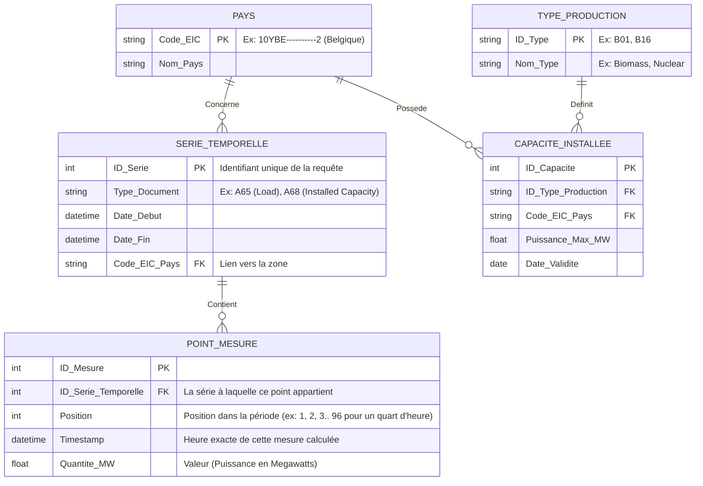

# Exercice 3 : Modélisation Projet ENTSO-E

L'énoncé demande d'imaginer un diagramme Entité-Association basé sur le projet ENTSO-E, afin de déduire un schéma relationnel utilisable.

On sait que l'on veut stocker des informations de consommation (Load), production (Generation), et potentiellement d'autres types sur différentes zones géographiques et à différentes périodes temporelles.

## 1) Diagramme Entité-Association (Conceptuel - Proposition)

## 2) Transformation en Schéma Relationnel

On élimine les concepts et on structure en tables. Ce schéma permet un stockage efficace des séries de données reçues par l'API pour éviter de re-télécharger.

1. **Table `ENT_PAYS`**
   - **`Code_EIC`** [PK, VARCHAR]
   - `Nom_Pays` [VARCHAR]

2. **Table `ENT_TYPE_PRODUCTION`**
   - **`ID_Type`** [PK, VARCHAR]
   - `Nom_Type` [VARCHAR]

3. **Table `ENT_SERIE_TEMPORELLE`** (Regroupe les métadonnées d'une requête)
   - **`ID_Serie`** [PK, INT Auto Increment]
   - **`#Code_EIC`** [FK vers ENT_PAYS]
   - `Type_Document` [VARCHAR, ex: "Load", "Generation"]
   - `Date_Debut_Periode` [DATETIME]
   - `Date_Fin_Periode` [DATETIME]

4. **Table `ENT_POINT_MESURE`** (Contient la donnée brute de chaque quart d'heure/heure, très volumineuse)
   - **`#ID_Serie`** [FK, PK]
   - **`Timestamp`** [DATETIME, PK] (La date exacte du point. Avec l'ID Série on a l'unicité).
   - `Position_Index` [INT]
   - `Valeur_MW` [FLOAT]

5. **Table `ENT_CAPACITE_INSTALLEE`** (Souvent rafraichi qu'une fois par an)
   - **`#Code_EIC`** [FK, PK]
   - **`#ID_Type`** [FK, PK]
   - **`Annee_ou_Date`** [DATE, PK]
   - `Valeur_Capacite_MW` [FLOAT]
