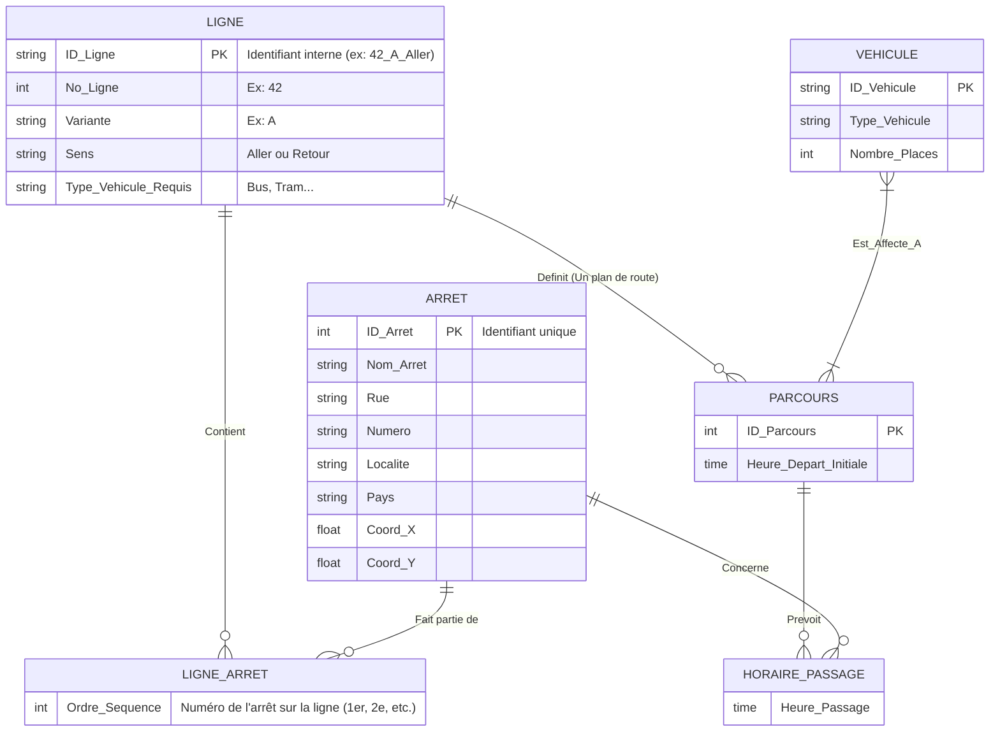

# Exercice 4 : Société des Transports Intercommunaux de Bastogne

## 1) Diagramme Entité-Association (Conceptuel)

**Analyse du texte :**
- **Lignes :** Numéro de ligne (`Num_Ligne`), Variante (Lettre), Sens (Aller/Retour), Type de véhicule autorisé (Bus, Tram...).
- **Arrêts :** Nom, Rue, No_Maison, Localité, Pays, Coordonnées (X, Y). **Attention:** un sens a son propre arrêt physique (ex: trottoir de gauche vs trottoir de droite) donc "ils correspondent à des sens de parcours différents".
- **Segments :** Relie deux arrêts (Arrêt Départ, Arrêt Arrivée). Une ligne est composée de *plusieurs* segments. Un arrêt peut intervenir dans plusieurs lignes/segments.
- **Parcours (Horaire global) :** Une execution d'une Ligne à un moment donné. Propriété : Heure de départ du 1er arrêt.
- **Horaire (Passage) :** Liste des heures de passages pour chaque arrêt du parcours (Heure prévue `HH:MM:SS`).
- **Véhicule :** N° Identification, Type, Nb Places. Est affecté à 1 ou plusieurs parcours.

---

## 2) Schéma Relationnel / Diagramme de Base de Données

On traduit l'association ci-dessus en tables relationnelles concrètes.

1. **Table LIGNE**
   - **`ID_Ligne`** [PK, Varchar] (Construit avec le No + Variante + Sens)
   - `Num_Ligne` [Int]
   - `Variante_Ligne` [Varchar]
   - `Sens` [Varchar(10)]
   - `Type_Requis` [Varchar]

2. **Table ARRET**
   - **`ID_Arret`** [PK, Int AI]
   - `Nom` [Varchar]
   - `Rue` [Varchar]
   - `Numero_Maison` [Varchar]
   - `Localite` [Varchar]
   - `Pays` [Varchar]
   - `Positions_X` [Float]
   - `Positions_Y` [Float]

3. **Table LIGNE_SEQUENCE (La composition géographique)** (Table Intermédiaire qui mappe les Lignes et les Arrêts)
   - **`#ID_Ligne`** [FK, PK Composée]
   - **`Ordre_Arret`** [Int, PK Composée] (ex: 1 pour le terminus départ, 2 pour le suivant)
   - **`#ID_Arret`** [FK]

4. **Table PARCOURS** (Ex: 'Le bus de 08:00 sur la ligne 42')
   - **`ID_Parcours`** [PK, Int]
   - **`#ID_Ligne`** [FK]
   - `Heure_Depart` [TIME]

5. **Table HORAIRE_PASSAGE** (Ex: 'Le terminus est prevu à 08:00, l'arret 2 a 08:04, etc')
   - **`#ID_Parcours`** [FK, PK Composée]
   - **`#ID_Arret`** [FK, PK Composée]
   - `Heure_Prevue` [TIME]

6. **Table VEHICULE**
   - **`ID_Vehicule`** [PK, Varchar]
   - `Type` [Varchar]
   - `Nombre_Places` [Int]

7. **Table AFFECTATION_VEHICULE** (Lien N-M car un véhicule fait plusieurs parcours dans la journée, et l'énoncé suggère un parcours = potentiellement plusieurs véhicules, ex: renforts)
   - **`#ID_Parcours`** [FK, PK Composée]
   - **`#ID_Vehicule`** [FK, PK Composée]
